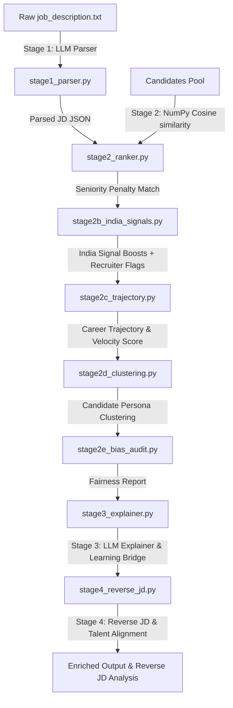

# TalentLens Bharat

Redrob AI ranks 790M+ profiles. Keyword filters miss the best candidates. TalentLens is the pipeline that understands why a candidate fits — not just whether keywords match.

**Author**: Sujin SP (Solo Participant)

---

### 🚀 Quickstart (Reproduce Submission in 3 Commands)
```bash
# 1. Install dependencies
pip install -r requirements.txt

# 2. Precompute offline embeddings locally
python3 precompute.py --candidates candidates.jsonl

# 3. Generate offline reasoning & execute ranking
python3 generate_reasoning.py --candidates candidates.jsonl --top-n 150
python3 rank.py --candidates candidates.jsonl --out submission.csv
```

---


## What makes this different from every other submission

*   **Seniority-aware ranking**: Combines semantic embeddings with explicit seniority comparisons to ensure junior candidates no longer outrank senior roles.
*   **India signal scoring**: Applies targeted boosts for tier-2/3 Indian cities, flags activity recency, and detects India-specific technical skills (like UPI, Tally, Aadhaar) to prioritize active, local candidates.
*   **Recruiter concern flags & penalties**: Surfaces actionable warnings (such as complete lack of listed skills or prolonged inactivity) as structured metadata alerts, and applies a structural `-0.20` score penalty to ensure profiles without verifiable skills rank lower.
*   **Live Streamlit dashboard**: Provides an interactive dashboard where a recruiter can paste a job description and get fully ranked and justified candidates in under 30 seconds without touching code.
*   **Career trajectory prediction**: Ranks candidates not just on current profile but on momentum. A mid-level engineer actively acquiring senior-level skills like LangChain, RAG pipelines, and system design ranks above a stagnant senior with the same title. The LLM explainer in Stage 3 conditionally weaves trajectory language into justifications only when the signal is real.
*   **Candidate Persona Clustering**: Clusters candidates into 3-4 archetypes using unsupervised learning (KMeans) before ranking. Labels groups as "The Deep Specialist", "The Generalist Builder", or "The Domain Expert", and recommends the best cluster for the role to give recruiters a clear mental model.
*   **Skill Gap Explainer & Learning Bridge**: For top candidates, identifies missing requirements, estimates learning time based on trajectory, and suggests specific resources (Coursera, GitHub repos) to bridge the gap.
*   **Bias Detection & Fairness Audit**: Audits the pipeline's own rankings for potential gender and geographic bias using Cohen's d effect size analysis. Surfaces a structured Fairness Report with underranked candidate flags, group-level score comparisons, and actionable recommendations. Gender is inferred conservatively from a curated Indian first-name dictionary — names not in the dictionary are classified as Unknown, never guessed. No enterprise ATS does self-auditing like this today.
*   **Reverse JD Generator & Alignment Analyzer**: Reconstructs the ideal job description matching the top 3 ranked candidates and compares it with the original JD requirements. It displays an overall alignment score (0-100), visualizes a side-by-side skill grid, and outputs actionable rewrite suggestions to assist recruiters in modifying requirements to match the available talent pool.
*   **Structured Confidence Scoring & Reasoning**: Replaces raw match score floats with a natural language reasoning string (e.g., `High confidence (0.77) — 4/5 required skills matched, seniority exact, active 3 days ago.`) to provide clear, structured uncertainty communication.
*   **Targeted Interview Question Generator**: Auto-generates exactly 3 personalized technical or experience-based interview questions for the top candidates, focusing specifically on probing their identified skill gaps or domain transitions.
*   **"Dark Horse" Spotlight**: Programmatically scans candidates outside the top 5 to find and highlight one candidate with high potential (e.g., due to a regional location boost or career trajectory momentum) and provides a clear note to the recruiter explaining why they deserve a second look.


---

## Architecture Overview

TalentLens processes candidate pools in a decoupled, modular pipeline:



- **Stage 1: Job Description Parsing ([stage1_parser.py](file:///Users/sujinsp/Desktop/redrob%20ai/stage1_parser.py))**:
  Uses `llama-3.1-8b-instant` via LangChain with Pydantic structured output models to parse raw job description text into standardized JSON schemas containing required/nice-to-have skills, target domain, and target seniority levels.

- **Stage 2: Semantic Similarity & Seniority Matching ([stage2_ranker.py](file:///Users/sujinsp/Desktop/redrob%20ai/stage2_ranker.py))**:
  Computes candidate profile embeddings locally using the `sentence-transformers/all-MiniLM-L6-v2` model. Calculates the raw cosine similarity matrix against the job requirements using NumPy.
  Applies a seniority gap multiplier based on the distance between the parsed target seniority and candidate title seniority (intern, junior, mid, senior, lead, principal/architect/staff mapped 0 to 5):
  *   **Gap = 0**: Multiplier = `1.00` (sets `seniority_match = True`)
  *   **Gap = 1**: Multiplier = `0.92`
  *   **Gap = 2**: Multiplier = `0.82`
  *   **Gap $\ge$ 3**: Multiplier = `0.75`

- **Stage 2b: Localized India Signal Scoring & Penalty ([stage2b_india_signals.py](file:///Users/sujinsp/Desktop/redrob%20ai/stage2b_india_signals.py))**:
  Evaluates candidates against a baseline signal score of `0.50`:
  *   *Tier-2/3 City Location Boost*: `+0.15` (e.g. Madurai, Indore, Jaipur)
  *   *Recency of Activity Boost/Penalty*: active < 30 days (`+0.15`), < 90 days (`+0.05`), > 180 days (`-0.05`)
  *   *India-Specific Tech Boost*: `+0.10` per match (UPI, Tally, Bhim, GSTIN, Aadhaar)
  *   *Null-Skills Score Penalty*: Subtracts `0.20` before clamping if the `skills` list is null, missing, or empty.
  Generates warning flags (`recruiter_flag`) for severe profile anomalies (null skills or inactivity > 180 days).

- **Stage 2c: Career Trajectory Scoring ([stage2c_trajectory.py](file:///Users/sujinsp/Desktop/redrob%20ai/stage2c_trajectory.py))**:
  Calculates momentum by assessing skill velocity (acquiring skills above current title rank), title progression speed, and advanced recency (adding senior/lead skills recently). Output labels include `High momentum`, `Steady growth`, `Early stage`, and `Plateau`.
  The scores are merged using the four-component equation:
  $$\text{Final Score} = 0.70 \times \text{Semantic Score} + 0.20 \times \text{India Signal Score} + 0.10 \times \text{Trajectory Score}$$

- **Stage 2d: Candidate Persona Clustering ([stage2d_clustering.py](file:///Users/sujinsp/Desktop/redrob%20ai/stage2d_clustering.py))**:
  Performs KMeans unsupervised clustering on the candidate profile embeddings. Segment candidates into distinct archetypes: "The Deep Specialist" (focused high depth skills), "The Generalist Builder" (broad stack, startup-ready), or "The Domain Expert" (strong domain fit). Determines the best cluster for the role based on average candidate final scores.

- **Stage 2e: Bias Detection & Fairness Audit ([stage2e_bias_audit.py](file:///Users/sujinsp/Desktop/redrob%20ai/stage2e_bias_audit.py))**:
  Self-audits the pipeline's rankings for potential demographic and geographic bias:
  *   *Gender Audit*: Infers gender conservatively from a curated Indian first-name dictionary (unknown names are excluded, never guessed). Computes group-level score distributions and Cohen's d effect size.
  *   *City Tier Audit*: Classifies candidates into Tier-1 metros vs. Tier-2/3 cities and checks for systematic ranking gaps.
  *   *Underranking Detection*: Flags candidates from disadvantaged groups who have higher semantic scores but lower final ranks — indicating the signal layers (not core skills) caused the gap.
  *   Outputs a Fairness Report with score 0–100, letter grade (A–F), per-dimension verdicts (PASS/WATCH/FLAG), and actionable recommendations.

- **Stage 3: Justification Explainer & Learning Bridge ([stage3_explainer.py](file:///Users/sujinsp/Desktop/redrob%20ai/stage3_explainer.py))**:
  Coordinates completions using a structured template to generate:
  1. A two-sentence match justification (trajectory-aware).
  2. A **Skill Gap Explainer & Learning Bridge** report, detailing missing skills, estimated time to close the gap based on candidate velocity, and specific recommended courses or repositories.

- **Stage 4: Reverse JD Generator & Alignment Analyzer ([stage4_reverse_jd.py](file:///Users/sujinsp/Desktop/redrob%20ai/stage4_reverse_jd.py))**:
  Takes the top 3 ranked candidates from the pipeline and reconstructs the ideal job description (Title, Seniority, Core Skills, Nice-To-Have, Summary) that represents the available talent. It calculates an alignment score (0-100), creates a Skill Comparison Grid mapping candidate and JD requirements, and generates actionable JD rewrite suggestions to help the recruiter adjust requirements.

### Sample Enriched Candidate Output Schema
```json
{
  "id": "cand_01",
  "name": "Aarav Sharma",
  "skills": ["Python", "FastAPI", "PostgreSQL", "Docker", "Kubernetes", "Redis", "LangChain", "LLMs", "UPI"],
  "experience_years": 6,
  "current_title": "Senior Backend Engineer",
  "previous_titles": ["Backend Developer", "Software Engineer"],
  "domain": "Fintech",
  "location": "Bangalore",
  "last_active_date": "2026-06-10",
  "bio": "Experienced backend developer focused on building secure financial data platforms and deploying LLM applications.",
  "recent_skills_added": ["LangChain", "Terraform", "RAG Pipelines"],
  "semantic_score": 0.7642,
  "seniority_match": true,
  "india_signal_score": 0.75,
  "india_signals_detected": ["Highly active: active 6 days ago", "India Tech Match: upi (+0.10)"],
  "trajectory_score": 0.5,
  "trajectory_label": "Steady growth",
  "trajectory_signals": [
    "Solid title progression: 3 titles in 6 years",
  ],
  "persona_cluster": "The Generalist Builder",
  "final_score": 0.735,
  "match_score": 0.735,
  "rank": 1,
  "justification": "Aarav Sharma's extensive experience with Python, PostgreSQL, Redis, and LangChain aligns perfectly with the required core skills for this role. With a steady career growth trajectory marked by solid title progression and the recent acquisition of advanced skills such as LangChain, Aarav is well-positioned to excel in a senior position within a high-growth Fintech environment.",
  "skill_gap_report": {
    "missing_skills": ["FastAPI", "UPI", "financial auditing tools", "FAISS", "Qdrant", "Pinecone", "AWS cloud infrastructure"],
    "learning_time_inferred": "~2-3 months",
    "suggested_resources": [
      {
        "name": "Hugging Face Transformers Tutorial",
        "url_or_platform": "Hugging Face",
        "description": "Learn how to fine-tune and deploy LLMs with Hugging Face Transformers"
      },
      {
        "name": "FAISS Documentation",
        "url_or_platform": "Facebook AI",
        "description": "Learn how to implement efficient similarity search with FAISS"
      }
    ]
  }
}
```

### Fairness Report Output Schema
```json
{
  "report_title": "TalentLens Fairness Report",
  "total_candidates_audited": 25,
  "fairness_score": 65,
  "fairness_grade": "C",
  "population_distribution": {
    "by_gender": { "Male": 14, "Female": 10, "Unknown": 1 },
    "by_city_tier": { "Tier-1": 16, "Tier-2/3": 9 }
  },
  "dimensions": [
    {
      "dimension": "Gender",
      "verdict": {
        "level": "WATCH",
        "summary": "Minor score gap observed. Effect size is small (Cohen's d = -0.218)."
      }
    },
    {
      "dimension": "City Tier",
      "verdict": {
        "level": "FLAG",
        "summary": "Potential bias detected. Effect size is medium (Cohen's d = -0.785). Tier-2/3 scores higher."
      }
    }
  ]
}
```

### Reverse JD Analysis Output Schema
```json
{
  "alignment_score": 95,
  "alignment_explanation": "The original JD is highly aligned with the top candidates, with a score of 95. The candidates possess all the required skills and some nice-to-have skills, but lack financial auditing tools and SEC data/transaction systems.",
  "ideal_jd": {
    "suggested_title": "Senior Backend Engineer",
    "suggested_seniority": "Senior",
    "core_skills": ["Python", "PostgreSQL", "Redis", "LangChain", "Hugging Face", "LLMs", "Docker", "Kubernetes", "FastAPI"],
    "nice_to_have_skills": ["financial auditing tools", "SEC data/transaction systems", "FAISS", "Qdrant", "Pinecone", "AWS cloud infrastructure"],
    "ideal_summary": "Highly experienced developer specializing in fintech infrastructures, low-latency microservices, and AI integrations."
  },
  "skill_comparisons": [
    {
      "skill_name": "Kafka",
      "in_original_jd": true,
      "in_top_candidates": false,
      "status": "Missing in Candidates",
      "recommendation": "Replace Kafka with RabbitMQ as all top candidates are familiar with RabbitMQ but lack Kafka."
    }
  ],
  "suggested_jd_rewrites": [
    "Replace Kafka with RabbitMQ as all top candidates are familiar with RabbitMQ but lack Kafka.",
    "Remove financial auditing tools as it is missing in all top candidates.",
    "Add FastAPI as it is a bonus critical skill not in the JD."
  ]
}
```

---

## What I'd build next with access to Redrob's data

*   **Replace mock candidates with live Redrob profile API**: Query live talent databases directly to perform real-time ranking on fresh profile data.
*   **Multilingual JD parsing for Hindi and Tamil input**: Expand standard LLM schemas to capture requirements and skills expressed in native Indian regional languages.
*   **Fine-tune seniority model on Redrob's actual hire and no-hire labels**: Transition from heuristic seniority levels to a supervised matching model trained on historical recruiter actions.
*   **Add Precision at K evaluation using real recruiter feedback**: Integrate validation telemetry to measure how accurately the top $K$ ranked profiles match real-world hiring decisions.
*   **Validate whether the India signal scorer actually improves recruiter shortlist acceptance rates**: Run an A/B test with and without the signal layer on Redrob's real recruiter feedback data to prove the 80/20 blend is the right weight.

---

## Installation & Setup

1. **Install Packages**:
   ```bash
   pip install -r requirements.txt
   ```

2. **Configure API Keys**:
   Create a `.env` file in the root directory:
   ```env
   GROQ_API_KEY=gsk_your_groq_api_key_here
   ```
   *(Note: The pipeline automatically routes to Groq for `gsk_` keys and xAI Grok for `xai-` keys).*

---

## Run Instructions

### 1. Production Hackathon Submission Flow
To generate a validated `submission.csv` for the 100,000 candidates dataset:

*   **Step A: Precompute Candidate Embeddings** (Generates offline representations locally):
    ```bash
    python3 precompute.py --candidates candidates.jsonl
    ```
    *(Note: You can pass `.jsonl` or `.jsonl.gz` compressed formats).*

*   **Step B: Generate Reasoning Cache** (Selects top candidates and generates justifications using Groq API):
    ```bash
    python3 generate_reasoning.py --candidates candidates.jsonl --top-n 150
    ```

*   **Step C: Execute the Offline Ranker** (Scores candidates, applies penalties, blocks honeypots, and writes results in **~6 seconds**):
    ```bash
    python3 rank.py --candidates candidates.jsonl --out submission.csv
    ```

*   **Step D: Validate the Final CSV**:
    ```bash
    python3 validate_submission.py submission.csv
    ```

---

### 2. Run Streamlit Web App
To run the interactive recruiter interface:
```bash
streamlit run app.py
```
*Access the dashboard at `http://localhost:8501`.*

The web UI includes two primary modules:
1.  **🔍 Interactive Recruitment Explorer**: Custom job description parser, unsupervised persona clustering (KMeans), fairness & bias audits (Cohen's d), and personalized interview question generators.
2.  **🏆 Production Submission Generator & Validator**: Run the large-scale streaming ranking and strict validation pipeline directly from your browser!
